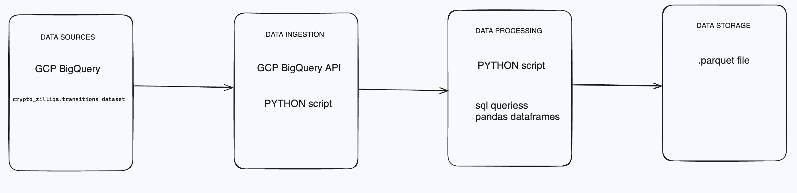

# Running the Project

# Data Pipeline Setup and Documentation

## Setup and Run Data Pipeline:

### Running Locally

1. **Environment Setup:**
   - Make sure you have Python 3.12 installed on your system.
   - Set up a virtual environment for the project to manage dependencies.
   - Install Poetry, a dependency management tool:
     ```bash
     pip install poetry
     ```

2. **Clone the Repository:**
   - Use the following commands to clone the repository and change to the directory:
     ```bash
     git clone <repository_url>
     cd <repository_directory>
     ```

3. **Install Dependencies:**
   - Install project dependencies with Poetry:
     ```bash
     poetry install
     ```

4. **Run the Data Pipeline:**
   - To execute the main Python script:
     - First, activate the Poetry shell:
     ```bash
     poetry shell 

     - Set the environment variable for Google credentials:
     export GOOGLE_APPLICATION_CREDENTIALS=/path/to/your/service-account-key.json

     - Run the script:
     python bq_to_parquet.py
     ```
     
## System Architecture Diagram:




## System Scalability and Edge Cases:
- Scalability:
   - BigQuery is highly scalable and can handle large datasets efficiently.
   - The pipeline can be scaled horizontally by running multiple instances of the data pipeline script to process data in parallel.
   - Autoscaling can be configured for GCP resources to handle variable workloads.
- Edge Cases:
   - Ensure proper error handling to handle potential issues such as network errors, query failures, and data inconsistencies.
   - Implement retry mechanisms for transient errors.
   - Monitor resource usage and performance metrics to detect and mitigate any issues in real-time.

## Additional Considerations:
- Security: Ensure proper access controls and encryption mechanisms are in place to protect sensitive data.
- Cost Optimization: Monitor resource usage and optimize configurations to minimize costs, especially for BigQuery usage.
- Data Quality: Implement data validation checks to ensure data integrity and accuracy.
- Continuous Integration/Continuous Deployment (CI/CD): Set up automated testing and deployment pipelines to streamline development and deployment processes.

